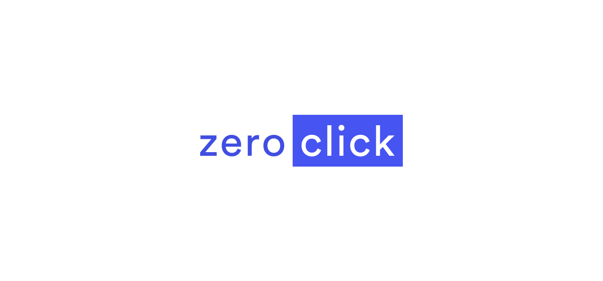

# zeroclick – 
A **web concept** for a zero click user experience.

## License
The project is developed under the **MIT** license:

- **Permissions**: This software and derivatives may be used for commercial purposes, you may distribute this software, this software may be modified and you may use and modify the software without distributing it.
- **Conditions**: Include a copy of the license and copyright notice with the code.
- **Limitations**: Software is provided without warranty and the software author/license owner cannot be held liable for damages.

Read the [full license](LICENSE.md) for more information about your rights.

## Questions?
If you have any questions, please **feel free to contact us!**  
[hello [at] studiomotio.com](mailto:hello@studiomotio.com)
